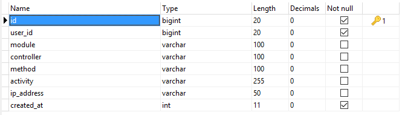

# Activities

* [Definition](#definition)
* [Creating Activities](#creating-activities)
* [Updating Activities](#updating-activities)
* [Deleting Activities](#deleting-activities)
* [Retrieving Activities](#retrieving-activities)

## Definition

Activities are a way to track users actions and reactions on the website. Think of them as history log where is stored who did what, when and where.

Take a look at activities table:



All you really need to provide as information are **user_id** and the **activity** string.

## Creating Activities

To log a new activity, you have two options (methods):
```php
$this->kbcore->activities->create(array()); // MUST be an array.
$this->kbcore->activities->log_activity($user_id, $activity);
// Or you can user the helper:
log_activity($user_id, $activity);
```
You can find some examples if you take a look at the provided **users** module (**Auth** library) where users interactions with the module are logged. Here is an example of activity log at user's login:
```php
// After a successful login:
log_activity($user_id, 'logged in'); // That's all.
```
Use your imagination and make acitivity history suit your needs. Let's assume that I have created a **CMS** using this CodeIgniter skeleton. What I can do it to record, for insteance, who published post **#111*** and then who edited it. Let's assume again that I have a module called **blog**, the controller to publish posts is named **posts** and the method is **create**. Here is what I can do:
```php
// After the user #73 created the post #111, I use their IDs:
log_activity(73, 111);
// That's all. Everything else is automatically added.
```
In my activities table, I will see the following:

| user_id | module | controller | method | activity |
| -- | -- | -- | -- | -- |
| 73 | blog | posts | create | 111 |

This can be translated as _the user #73 published a new post #111_.

Now when another user (i.e **#23**) edits the post (the method is **edit**), at a successful updated, I can log the activity like so:
```php
log_activity(23, 111); // That's all.
```
So in my activities table I would have:

| user_id | module | controller | method | activity |
| -- | -- | -- | -- | -- |
| 23 | blog | posts | edit| 111 |

This can be translated later as : _the user #23 edited the post #111_.

## Updating Activites

In fact, because they are automatic, it is better not to update them at all. This way you garanty you don't mess up with what was previously logged.
But there are some cases where you want to update them. For example: lets assume you changed the controller's name **posts** of the module **blog** to something else, let's say **blog**. Now you really want to update all of this module's activities **controller** column to use blog instead of posts. This why we have added **update** and **update_by** method (this time with no helpers).
```php
// To update a single activity knowing its ID.
$this->kbcore->activities->update($id, array $data);
// Or you can use the helper:
update_activity($id, array $data);

// To update a single or multiple ones by arbitrary WHERE clause:
$this->kbcore->activities->update_by(array $where, array $data);
// Or you can use the helper:
update_activity_by(array $where, array $data);
// Or its alias:
update_activities(array $where, array $data);

// To update all activities, user $data instead of $where:
$this->kbcore->activities->update_by(array $data);
update_activity_by(array $data);
update_activities(array $data);
```
Let's stick to the example given above and say I want to change the blog controller from **posts** to **blog** for all activities, I can do this:
```php
$this->kbcore->activities->update_by(
	array(	// This is the WHERE clause.
		'module'     => 'blog',
		'controller' => 'posts',
	),
	array('controller' => 'blog'),
);
// Or the helper
update_activity_by(
	array(	// This is the WHERE clause.
		'module'     => 'blog',
		'controller' => 'posts',
	),
	array('controller' => 'blog'),
);
// Or its alias:
update_activities(
	array(	// This is the WHERE clause.
		'module'     => 'blog',
		'controller' => 'posts',
	),
	array('controller' => 'blog'),
);
```

## Deleting Activities

There are two methods and their helpers to delete activities. Here some example to demonstrate them.

In order to delete a single activity assuming that you know its **ID**:
```php
$this->kbcore->activities->delete($id);
// Or using the helper:
delete_activity($id);
```
The method below deletes a single activity by arbitrary _WHERE_ clause. But it is also used to delete multiple activities as well and if used without arguments, it will delete **ALL** activities.
```php
$this->kbcore->activities->delete_by($field, $match);
// Or its helper and alias:
delete_activity_by($field, $match);
delete_activities($field, $match);
```
Below are some examples to explain better:
```php
// Example #1: Delete all activities of user #23
elete_activities('user_id', 23);

// Example #2: Delete activites of user #23 on module "blog".
delete_activities(array(
	'user_id' => 23,
	'module'  => 'blog',
));

// Example #3:
// Delete user #23 activites on modules "blog" and"messages":
delete_activities(array(
	'user_id' => 23,
	'module'  => ['blog', 'messages']
));

// Example #4: Delete activities older than 6 months:
delete_activities('created_at <', MONTH_IN_SECONDS * 6);
```
**Note**: Because "_delete_activities_" and "_delete_activity_by_" do the same thing, I only used the first one in the examples above.

## Retrieving Activities

Here is how you can retrieve activities:
```php
// If you know the activity's ID:
$this->kbcore->activities->get($id);
// Or the helper:
get_activity($id);

// To retrieve single activity by arbitrary WHERE clause.
$this->kbcore->activities->get_by($field, $match);
get_activity($field, $match);

// To retrieve multiple activities by arbitrary WHERE clause.
$this->kbcore->activities->get_many($field, $match);
// Of the helper:
get_activities($field, $match);
```
Sticking to the blog example and for a better explanation, here are few examples:
```php
// Example #1:
// Retrieve the activity where user#73 created the post#111
$activty = $this->kbcore->activities->get_by(array(
	'user_id'    => 73,
	'module'     => 'blog',
	'controller' => 'posts',
	'method'     => 'create',
	'activity'   => 111,
));
// To access the object:
echo $activity->ip_address;
echo date('Y-m-d H:i:s, $activity->created_at);

// Example #2: retrieve all posts publishing activities.
$activities = get_activities(array(
	'module'     => 'blog',
	'controller' => 'posts',
	'method'     => 'create',
));

// Example #3: get a list of all post#111 updated.
$updates = get_activities(array(
	'module'     => 'blog',
	'controller' => 'posts',
	'method'     => 'edit',
	'activity'   => 111,
));
```
In the example **#4**, we will have an array of activities objects that you can use later to retrieve all users who made updates on the selected post (**#111***). Here is how I personally proceed after:
```php
// We have collected all activities, now we get users.
$users_ids = array();

// Now we fill our $uses_ids array.
foreach ($activities as $activity)
{
	$users_ids[] = $activity->user_id;
}

// Now that we have users IDs array, let's get users.
$users = $this->kbcore->users->get_many('id', $users_ids);
// Or the helper:
get_users('id', $users_ids);
```
As you can see, you are not as limited as you think you are. Explore the library for more details.
