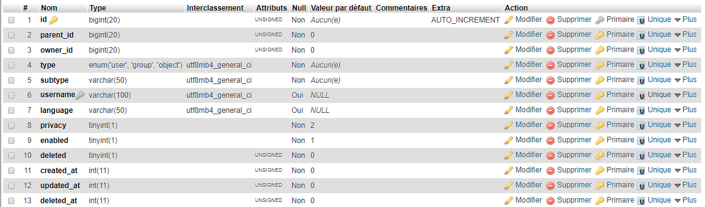

# Entities

All what's on the website is considered to be an **entity**. Users, groups, and objects are all entities. The reason behind this approach if to have real **Global Unique IDs** and unique usernames. This way, if you displaying the entity's page is done by simply going to "*site_url/__username__*".
In fact, if you take a look at **entities** table, you will see that there are two columns that determine the real type of an entity: **type** and **subtype**.
* **Type** tells on which table to retrieve the rest of the data.
* **subtype** tells only the real type of the entity.

For instance, an entity of type **user** is treated as a user where the rest of data is stores in **users** table, **group** in **groups** table and **object** in **objects** table. These are the only allowed types but you are free to assign any **subtype** you want while building your application (see respective documentations for more details).

* [Table Structure](#table-structure)
* [Creating Entities](#creating-entities)
* [Retrieving Entities](#retrieving-entities)
* [Searching Entities](#searching-entities)
* [Updating Entities](#creating-entities)
* [Deleting Entities](#deleting-entities)
* [Restore Entities](#restore-entities)
* [Counting Entities](#counting-entities)
* [Bonus](#bonus)
* [Important](#important)

## Table Structure

Let's us now talk in depth about **entities** an their table.



If you check the table, the most important columns are:

- __parent_id__: This is useful if you want to make your entities hierarchical.
- __owner_id__: If a group or object is created by a user, it's a good practice to put his/her id there. Not only that, if for instane objects belong to a given group, this column is also useful to say that the group owns those objects ... etc ! *Use your imagination*.
- __type__: Entities types are important. There are three types of entities: **user**, **group** and **object**. To know more about them, please refer to their corresponding documentation.
- __subtype__: This is the column that plays the biggest role. All of your site's entities are divided into subtypes **YOU CHOOSE**. For instance, the provided **menus** module stores menus as **group** entities while using **menu** as the **subtype**. This module store menus items (links) as **object** entities while using **menu_item** as **subtype**... ect! *Use your imagination*.
- __username__: This is one of the unique columns (with ID). It is an optional column for certain entities that do not require usernames but are necessary for others (such as users).
- __language__: Even if it is an optional column, it comes handy if you want to make your website multilingual. For instance, if a user uses **french**, when he/she logs in, the site's language changes. If you store static pages for insteace and you want to translate them, you can store their languages there as well.
- __privacy__: This is as well an optional column with default value **2**. The idea behind this is to make entities access by privacy level. By default, we are using:
	- __-1__: For entities accessible to owners only.
	- __0__: For entities accessible to owners only. If you allow users to follow each other for instance or develop a friendship system between users, this can be used to display entities for entities in relation with the owner only.
	- __1__: For entities accessible to registered and logged in users.
	- __2__: For entities that are publicaly accessible.

Other columns, *enabled*, *deleted*, *created_at*, *updated_at* and *deleted_at* are automatically handled so you don't worry about them.
**Note**: The *deleted* column is the one used to **soft delete** entities. It is set to **1** after deletion and the *deleted_at* will hold the timestamp.

## Creating Entities

If you take a look at entities library, the `create` method, you will see that it checks four (**4**) things before creating the entity:

1. The method has received arguments (*array*).
2. The entity's *type* is set and is one of the three mentioned above.
3. The entity's *subtype* is set.
4. The entity's *username* is available.

So you make sure all these conditions are full-filled before proceeding.
In order to create a new entity, you may use the `create` method or its helper `add_entity` like so:

```php
// $guid is the new create entity's ID.
$guid = $this->kbcore->entities->create(array(
	'type'     => 'user',
	'subtype'  => 'administrator',
	'username' => 'bkader',
	'language' => 'arabic',
	'privacy'  => 1,
...
));
// Of its helper:
$guid = add_entity(...);
```

As you have certainly noticed, these method and function will always return the new created entity's **ID** IF created, otherwise they will return `FALSE`.
If the provided username is already in use, this method/function will generate a new one for it, appending a number to to.

## Retrieving Entities

Retrieving entities is simple. You can get a single one, and the returned is an object, or retrieve multiple ones where the returned result should be an array of objects. See below:

```php
/*
#1 - To retrieve a single entity, you can pass its known ID
or username to the method/function below:
*/

$this->kbcore->entities->get($id);
get_entity($id);

/*
#2 - To retrieve a single entity by arbitrary WHERE clase, 
you may use the method/function below.
NOTE: this method or function returns a SINGLE object, so
if you want to retrieve multiple ones, you may consider using
the "get_many" method.
*/

$this->kbcore->entities->get_by($field, $match);
get_entity_by($field, $match);

/*
#3 - To retrieve all, or multiple entities, you can use the 
method below, where $field is the comparison field and $match
is the comparison value.
If $field is an array, you can omit $match.

If this method/function is used without arguments, all existing
entities with be targeted.
*/

$this->kbcore->entities->get_many($field, $match);
get_entities($field, $match);

// EXAMPLES:

// This will retrieve all entities of type "user".
get_entities('type', 'user');

// This will retrieve all entities of type "user"
// and subtype "administrator".
get_entities(['type' => 'user', 'subtype' => 'administrator']);

// Retrieve all users groups where privacy > 1
get_entities(['type' => 'group', 'subtype' => 'users', 'privacy >' => 1]);
```
*Play with it the way you want*.

## Searching Entities

As of version **1.3.0**, it is possible to search entities. To do so, you may use the `find` method or its helper `find_entities`:

```php
$result = $this->kbcore->entities->find($field, $match, $limit, $offset);

// Or the helper:
$result = find_entities($field, $match, $limit, $offset);
```

## Updating Entities

There are two (**2**) method to update entities (+3 helpers):

* The `update` method targets a single entity and it uses its **ID** or **username** because they are the unique values on the table.
* The `update_by` method will target a single, mutiple or even all entities.

See examples below to see how it can be done:

```php
/*
In order to update a single entity by its given ID,
simple pass the ID as the first argument, then an
array of what you want to update as the second
argument.
*/
$this->kbcore->entities->update($id, array(
	'username' => 'new_username', // An example only.
));

// OR you can user the helper:
update_entity($id, ['username' => 'new_username']);

/*
To update a single, all or multiple entities by arbitrary
WHERE clause, you may use the method below.
Make sure you use the WHERE clause as the first argument,
and the data to update as the second one.
*/
$this->kbcore->entities->update_by(

	array('username', 'bkader'), // <- WHERE clause.

	array( // <- Date to update
		'privacy' => 2,
		'subtype' => 'administrator'
	)

); // (*)

// Or you can user its helpers, with same arguments:
update_entity_by(
	['username' => 'bkader'],	// <- WHERE clause
	['privacy' => 2] 			// <- Date to update.
);
update_entities(
	['username' => 'bkader'],	// <- WHERE clause
	['privacy' => 2] 			// <- Date to update.
);

/*
You can see above that we are targeting the user
with username "bkader". In case you're sure of the
username and want to target a single entity, you can
simply do:
*/
$this->kbcore->update('bkader', ['privacy' => 2]);

// Or the helper:
update_entity('bkader', ['privacy' => 2]);
```

In case you use fields that are unique on the table, like **ID** or **username**, this `update_by` method will always target a single row. Example:

```php
$this->kbcore->entities->update_by(['id' => 1], ['username' => 'new_username']);
```

In case you want to target all entities, simply pass a single argument to the method. It should be an array of data to update. If a single argument is passed, the `WHERE` clause is ignored and all entities will be targeted.

As of version **1.3.x**, entities retrieved are instances of `KB_Entity` class that you can use to retrieve details or update the entity. Example:

```php
// Let's find the entity with ID #1
$entity = get_entity(1);

// Display username:
echo $entity->username;

// Display a metadata:
echo $entity->meta_name; // i.e: echo $entity->company;

// Updating a single detail:
$entity->update($field, $value); // Returns a boolean.

// To queue changes, you have two options:
$entity->privacy = 2; // OR
$entity->set('privacy', 2);

// Then you can call the "save" method to save changes:
$entity->save(); // Returns a boolean.
```

## Deleting Entities

If you check at the end of this page, or the **entities** table, there are two columns handling deletion: `deleted` and `deleted_at`. What do you think they are used for?  
Well, we have added the **soft delete** concept, it means that even if entities are deleted, they and their related data are kept on the database, but they are not publicly visible, they can be restored later, anytime you want. However, **removed** entities can no longer be restored, they're gone forever, as well as all their related data. It's okey, don't be sad, you simply should have read the documentation first :sad:.

Let's see how to delete/remove entities:

```php
/*
To delete/remove a single entity, knowing its ID or username,
you can use methods below or their respective helpers:
*/
$this->kbcore->entities->delete($id); // ID or username.
$this->kbcore->entities->remove($id); // ID or username.

// Or you can user helpers:
delete_entity($id);
remove_entity($id);

/*
In order to delete/remove a single, all or multiple entities
by arbitrary WHERE clause, here is how you should proceed:
*/
$this->kbcore->entities->delete_by($field, $match);
$this->kbcore->entities->remove_by($field, $match);

// Or their respective helpers:
delete_entity_by($field, $match); // Alias: delete_entities($field, $match);
remove_entity_by($field, $match); // Alias: remove_entities($field, $match);
```

In the last examples, **$match** (the comparison value) is optional in case **$field** (the comparison field). In examples below, we are simply using the `delete` method because `remove` is used the same way.

```php
// Here is how it is simply done using the $field - $match.
$this->kbcore->entities->delete_by('username', 'bkader');

/*
In the example below, we are targeting all entities WHERE ids are
in an array. So:
$field: string
$match: array
*/
$this->kbcore->entities->delete_by('id', [1, 7, 13]);
delete_entity_by('id', [1, 7, 13]);
delete_entities('id', [1, 7, 13]);

/*
In the example below, we are omitting $match an using an array as $field.
Example:
Delete multiple entities of type "user" that have not be enabled and
where created more than 2 days ago.
*/
$this->kbcore->entities->delete_by(array(
	'type'         => 'user',
	'enabled'      => 0,
	'created_at <' => (DAY_IN_SECONDS * 2), // Added constant.
));

// Or the helper
delete_entities([
	'type'         => 'user',
	'enabled'      => 0,
	'created_at <' => (DAY_IN_SECONDS * 2), // Added constant.
]);
```

## Restoring Entities

As said earlier, entities that were **removed** can **NO LONGER** be restored, they are permanently erased from database and all what's related to them to. But, those that were `deleted` or better, flagged as deleted, can be restored anytime using the examples below:

```php
// If you want to restore a single entity:
$this->kbcore->entities->restore($id); // ID or username.

// Or its helper:
restore_entity($id);


// In case you want to restore multiple entities:
$this->kbcore->entities->restore_by($field, $match);

// Or its helpers:
restore_entity_by($field, $match);
restore_entities($field, $match);
```

**Note**: _restore_entity_by_ and _restore_entities_ are certainly used to restore multiple entities, but they can also be used to restore a single entity by arbitrary _WHERE_ clause. Simply use a unique value field for your WHERE clause.

## Counting Entities

As of version **1.3.x**, it is possible to count entities using the `count` method or its helper `count_entities`.

```php
$count = $this->kbcore->entities->count($field, $match, $limit, $offset);
$count = count_entities($field, $match, $limit, $offset);
```

## Bonus

There are additional method that may be useful when developing your application.

```php
// To retrieve entities IDs only:
$ids = $this->kbcore->entities->get_all_ids($field, $match);

// Or the helper:
get_entities_ids($field, $match);

/*
In the example below, we are trying to get all users IDs WHERE 
roles (subtypes) are "administrator" OR "moderaotr" for example.
*/
get_entities_ids('subtype', ['administrator', 'moderator']);
```

## IMPORTANT

All methods and functions are to be used in controllers. In case you want to use them in libraries, make sure to never use helpers because they may trigger an `undefined property: $kbcore` error.
