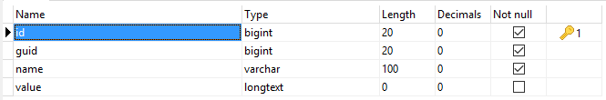

As their name means, these are additional informations about an existing entity. The difference between them and **variables** is that these are kind of permanent informations that do get updated but not as often as variables do.

For example, you can use metadata to store users phone numbers; address; website; biographies; social links ... etc.
You can use them to store products prices; products wishlists; users, objects or groups extra details that cannot be put inside their respective tables.

## Table Structure



Let's explain the table a bit:

* **id** (*auto*): Auto-incremented metadata IDs.
* **guid** (*int*): The ID of the entity to which the metadata belongs.
* **name** (*string*): The metadata key (lowercased string).
* **value** (*mixed*): The metadata value, it can be anything: string, integer, boolean or even arrays and objects.

## Creating Metadata

After creating the entity you want (user, group or object), you can (MUST) use its ID to create metadata for it. In your controllers, you can use:

```php
# To create a single metadata.
$this->kbcore->metadata->create(array $data);

# A similar method:
$this->kbcore->metadata->add_meta($guid, $meta, $value);

# Or you can use the function:
add_meta($guid, $name, $value);
# $guid here is the entity's ID.
```

If you want to create multiple metadata for the selected entity, you only need to pass an associative array as the second parameter like so:

```php
$this->kbcore->metadata->create($guid, array(
	'phone' => '0123456789',
	'company' => 'Company Name',
		'location' => 'Algeria',
		'address', # (1)
		'website', # (2)
), $value);

# "address" and "website" have not values,
# so they will be created by but they will
# use the third argument ($value) as a value.
# Default: NULL
```

## Updating Metadata

To update a metadata, you can use either the **update** method or the **update_meta** function. So in your controllers, This first one users the metadata **ID** as the first argument, so it targets the desired one, while the other 	one accepts thee (**3**) arguments. I explain in the examples below:

```php
# To update a single metada using its ID, simply pass the ID as 
# the first argument, then specify an array of what you want to update.
$this->kbcore->metadata->update($id, array $data);

# The following method takes the entity's ID as the first argument
# and the meta name as the second argument.
# Once these provided, you can specify the new meta value.
$this->kbcore->metadata->update_meta($guid, $name, $value);

# Or use the helper function:
update_meta($guid, $name, $value)
```

To update multiple metadata, pass an array as the second parameter like so:

```php
$this->kbcore->metadata->update($guid, array(
	'phone' => '0987654321',
	'company' => 'New Company',
	'address', # <- It will use $value
	'website' => 'https://ianhub.net/'
), $value);

# Or use the helper function:
update_meta(...); # Same arguments.
```

**NOTE**: The **update** method will only update an existing meta. The **update_meta** method and its helpers will update it if it exists but also create it if it does not. So, they may also be used to create metadata.

If you want to update a single or multiple metadata by arbitrary _WHERE_ clause, you can use the following method:

```php
$this->kbcore->metadata->update_by($where, $data);

# Or the helper:
update_meta_by($where, $data);
```

**Note**: if you pass only **where**, it will be treated as the **data** to be updated and all metadata will be updated.

Examples of updating metadata:

```php
# Example #1: Setting all phone numbers to NULL.
$this->kbcore->metadata->update_by(
	array('name' => 'phone'), 		# WHERE clause.
	array('value' => '123456789')	# Date to update.
);

# Or the helper.
update_meta_by(['name' => 'phone'], ['value' => null]);

# Example #2: Setting all phones and address to NULL.
$this->kbcore->metadata->update_by(
	array('name' => array('phone', 'address')),	# WHERE clause.
	array('value' => NULL)						# Data to update.
);

# Or the helper:
update_meta_by(
	array('name' => ['phone', 'address']),	# WHERE clause.
	array('value' => NULL)					# Date to update.
);
# ... etc
```

## Deleting Metadata

In order to delete metadata, you can use the method **delete** or the helper **delete_meta**. So in your controllers, you may have:

```php
# Here wwe are deleting a metadata by its known ID.
$this->kbcore->metadata->delete($id);

# A similar method:
$this->kbcore->metadata->delete_meta($guid, $name);

# Or if you use the helper:
delete_meta($guid, $name);
```

To delete multiple metadata, you have two options, pass an array as the second parameter, or cascade parameters like the example below:
Let's say I want to delete "phone" and "company".

```php
# Option 1:
$this->kbcore->metadata->delete_meta(
	# The entity's ID.
	$guid,
	# What metadata to delete.
	['phone', 'company']
);

# Option 2:
$this->kbcore->metadata->delete($guid, 'phone', 'company');

# You can use the helper function:
delete_meta($guid, ['phone', 'company']);
```

You can delete metadata by arbitrary _WHERE_ clause as well:

```php
$this->kbcore->metadata->delete_by(...);

# Or the helper:
delete_meta_by(...);
```

Examples of deleting metadata:

```php
# Example #1: delete all metadata of a given entity.
delete_meta_by('guid', 1);

# Or:
delete_meta_by(['guid' => 1]);

# Multiple entities:
delete_meta_by('guid', [1, 5, 7]);

# Example #2: delete all metadata by name(s)
delete_meta_by('name', 'phone');

# Multiple names:
delete_meta_by('name', ['phone', 'address', 'website']);

# Example #3: using array.
delete_meta_by(array(
	'name' => ['phone', 'address', 'website'],
	'value' => NULL,
));

# Is like saying: delete all phone numbers, addresses and
# websites metadata that have empty values.
```

## Retrieving Metadata

You can retrieve metadata by using the **get** method or the **get_meta** function. The first method takes the known metadata **ID** as the argument. The second one accepts three arguments. I explain in the examples below.

```php
# To retrieve a single metadata by its known ID, you can use 
# the "get" method like below. If found, you will have to deal
# with the metadata object.
$meta = $this->kbcore->metadata->get($id);

# To retrieve the value:
echo $meta->value;

# The following method takes the entity's ID as the first argument
# and the meta name (or key) as the second argument.
# The third argument is a boolean used to directly return the
# meta value or the whole meta object.
$phone = $this->kbcore->metadata->get_meta(1, 'phone');

# Phone is an object, to access the value:
echo $phone->value;

# If we use the third argument:
$phone = $this->kbcore->metadata->get_meta(1, 'phone', TRUE);
echo $phone; # This is the value of the meta.

# Or you can use the helper:
$phone = get_meta(1, 'phone', TRUE);

# If you want to retrieve all metadata that an entity owns, simply
# pass its ID (entity) as a unique argument.
$metadata = $this->kbcore->metadata->get_meta($guid);

# Or the helper:
$metadata = get_meta($guid);
```

There are additional methods and their helpers that you can use to retrieve a single or multiple metadata by arbitrary _WHERE_ clause: **get_by** and **get_many**.  

Examples of using **get_by**:

```php
# To retrieve a single metadata:
$this->kbcore->metadata->get_by($field, $match);

# Or its helper:
get_meta_by($field, $match);

# Example #1:
get_meta_by(['guid' => 1, 'name' => 'phone']);

# Example #2:
get_meta_by(array(
	'guid' => 1,
	'name' => ['phone', 'address', 'website']
));

# In the example #2, one of them is returned, if you want to retrieve
# them all, you may consider using the "get_many" method and its
# helper "get_many_meta" instead.
```

Examples of using **get_many**:

```php
# To retrieve multiple metadata:
$this->kbcore->metadata->get_many($field, $match);

# Or its helper:
get_many_meta($field, $match);

# Example #1: Retrieve all phone numbers.
get_many_meta('name', 'phone');

# Example #2: Retrieve all phone numbers and address.
get_many_meta('name', array('phone', 'address'));

# Example #3: Alternative version of example #2
get_many_meta(array(
	'name' => ['phone', 'address']
));

# Example #4: Retrieve phone numbers for given entities.
get_many_meta(array(
	'guid' => [1, 2, 3],
	'name' => 'phone',
));

# Example #5: Retrienve phones and addresses for given entities.
get_many_meta(array(
	'guid' => [1, 2, 3],
	'name' => ['phone', 'address'],
));
```

## Purging Metadata

Sometimes users, objects or groups are deleted from **entities** table. And because they no longer exist, it is kind of useless to keep their metadata, this is why the **purge** method or **purge_meta** function were added.
These funtions will simply delete ALL metadata of entity's that do not exist. That's all. To use them:

```php
$this->kbcore->metadata->purge();

# Or the helper:
purge_meta();
```

---  

## IMPORTANT
All methods and functions are to be used inside controllers. In case you want to use them inside libraries, make sure to never use helpers because they may trigger an `undefined property: $kbcore`  error.
