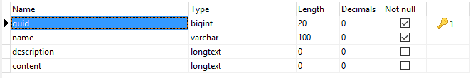

# Objects

* [What are objects?](#what-are-objects)
* [Creating Objects](#creating-objects)
* [Updating Objects](#updating-objects)
* [Deleting Objects](#deleting-objects)
* [Retrieving Objects](#retrieving-objects)
* [Counting Objects](#counting-objects)
* [IMPORTANT!](#important)

## What are object?
Objects are one of the three (**3**) available entities types. Every entitiy that is not a user or and group is considered an object. Example:
* A blog **post** is treated as an object.
* An uploaded **image** can be stored as an object.
* Menus **items** are stored as objects... etc.



I let you think of other objects, I just gave you examples :)

## Creating Objects
The same way as creating **users** or **groups**, you can create objects by using the provided **create** method or its helper **add_object**. Example:
```php
/*
 * To create an object, pass an array of object's details
 * to the "create" method. Anythin that can be found
 * on "entities" and "objects" table are inserted to
 * them. Any additional arguments will be treated as
 * metadata and will be inserted into the "metadata"
 * table once the object is created.
 */
$this->kbcore->objects->create($data);
// Or you can use the helper:
add_object($data);
```
## Updating Objects
You can update a single, all or multiple objects depending on the method or function you use. Let me explain in example:
```php
/*
 * To update a single obect by its ID, pass its known
 * ID as the first argument, then an array of whatever
 * you want to update as the second argument.
 */
$this->kbcore->objects->update($id, $data);
// Or use the helper:
update_object($id, $data);

/*
 * To update a single, all or multiple objects by
 * arbitrary WHERE clause, use the "update_by"
 * method or its helpers: "update_object_by" or
 * "update_objects".
 */
 $this->kbcore->objects->update_by(
	// The first argument is the WHERE clause.
	 array('name' => 'objectname'),
	 // The second is the array of what to update.
	 array('description' => 'New description.')
 );
 // Or use helpers:
 update_object_by(...);	// Same arguments.
 update_objects(...);	// Same arguments.
```

## Deleting Objects
Part of objects data are stored in **entities** table which has **soft_delete** enabled. It means that they will not be deleted from database but only hidden from access.
When building your application up, think of what should your featured do, delete or remove.

To delete objects, you have multiple choices:
```php
// Delete a single object by its ID:
$this->kbcore->objects->delete($id);
delete_object($id);

// To delete a single, all or multiple objects:
$this->kbcore->objects->delete_by($field, $match);
delete_object_by($field, $match);
delete_objects($field, $match);
```
Deleting multiple objects accept various arguments combination. Below are some examples on how to do it:
```php
// Delete multiple objects by IDs:
delete_objects('id', array(1, 12, 23));

// Delete by their IDs and subtypes:
delete_objects(array(
	'subtype' => 'objects_subtypes',
	'id'      => array(1, 12, 23, 34),
));
```
`This is the hard delete part, may be you should consider what to do before using the following methods.`

Objects can be completely removed from database, as well as all things related to them (metadata, variables ... etc). There are several methods and functions you may use, they are the same as the delete methods, simply remplace **delete** with **remove**.
```php
// Remove by its ID.
$this->kbcore->objects->remove($id);
remove_object($id);

// Arbitrary WHERE clause.
$this->kbcore->objects->remove_by($field, $match);
remove_object_by($field, $match);
remove_objects($field, $match);
```

## Retrieveing Objects
Retrieving objects is easy. It can be done using a object's ID for single object retrieving, or arbitrary WHERE clause for a single or multiple objects retrieving. Examples:
```php
// Retrieve a single object by its ID.
$this->kbcore->objects->get($id);
get_object($id); // The helper.

// Retrieve a single object by arbitrary WHERE clause.
$this->kbcore->objects->get_by($field, $match);
get_object_by($field, $match); // The helper.

// To retrieve all or multiple objects by WHERE clause
$this->kbcore->objects->get_many($field, $match, $limit, $offset);
get_objects($field, $match, $limit, $offset);

// To retrieve all objects
$this->kbcore->objects->get_all($limit, $offset);
get_all_objects($limit, $offset);
```
## Counting Objects
In order to count objects, you can use the **count** method or its helper **count_objects**. They both accept two arguments used to filter objects before returning the count.
```php
$this->kbcore->objects->count($field, $match);
count_objects($field, $match);
```
## IMPORTANT
All methods and functions are to be used in controllers. In case you want to use them in libraries, make sure to never use helpers because they will trigger an `undefined property: $kbcore` error.
