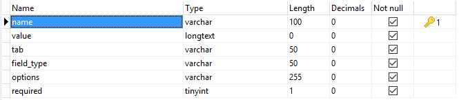

Options are simply site settings stored in **options** table. Even if this table is empty, some options are still found and they are stored inside *skeleton/config/defaults.php* file.  

They can hold anything you want as a setting on your application: themes settings, plugins settings ... etc ! Use your imagination.

## Table Structure



Let's example the table a bit:

* **name** (*required*): This is the table's primary key. Each option must have a unique name (*key*) used to retrieve it. Examle: `site_name`.
* **value** (*optional*): Holds options values, you may store anything, don't worry, when retrieving them you get them as you put them. You can store strings, boolean, arrays, or objects.
* **tab** (*optional*): This field is useful in case you want to organize your options by groups. For instance, **email** tab is to hold options related to email settings. Another example for themes or plugins, you may use this field to store options under the plugin/theme name so you can retrieve all options later.
* **field_type** (*required*): If you want to output the option so the user can edit them, this holds the field's type: text, select (dropdown), number, date, email ... anything you want.
* **options** (*optional*): This holds available options (or default values) for the given field. For instance, a droprown field may have an array of select options stored there ... etc
* **required** (*optional*): This is set to **1** to make the option available without getting it from database, **0** if the option is not available unless requested using *get_option* function.

## Creating Options

In order to create new options, you can do like in the example below:

```php
# $data here is an array of data to insert.
$this->kbcore->options->create($data);

# Similar method but with lots of arguments:
$this->bkcore->add_item(
	$name,			# String
	$value,			# Mixed
	$tab,			# String
	$field_type,	# String
	$options,		# Mixed
	$required 		# Boolean
);

# Or the helper:
add_option(
	$name,			# String
	$value,			# Mixed
	$tab,			# String
	$field_type,	# String
	$options,		# Mixed
	$required 		# Boolean
);
```

If you want to display the option on the administration panel, make sure to complete all arguments and edit the corresponding controller and view to display it. Example:

```php
$this->kbcore->options->create(array(
	'name'       => 'allow_registration',
	'value'      => true,
	'field_type' => 'dropdown',
	'options'    => array('true' => 'Yes', 'false' => 'No'),
	'required'   => true,
));

# Or
$this->kbcore->options->add_item(
	'allow_registration',	# The option's name.
	true,					# The options's value.
	'users',				# On which tab to display.
	'dropdown',				# Type of the form input (select).
	array(					# Available dropdown options
		'true' => 'Yes',	# Or: 'lang:yes' to translate.
		'false' => 'No',	# Or 'lang:no' to translate.
	),
	true					# Make the field required
);
```
To display it, go to *skeleton/modules/settings/controllers/Admin.php* and edit the section you have choose as **tab** (or add a new one and don't forget to add the view and edit other views so they include the link to it).

## Updating Options

Several methods are available in order to update a single or multiple options. Let me explain with few examples:

```php
# To update a single option by its name, use it as the first argument.
# The second argument should be an array of whatever you want to update
# (value, tab, field_type, options or required).
$this->kbcore->options->update($name, $data);

# In case you want to only update the value of the option, you may
# use to the method above, but there is another method that use can
# use to achieve this.
$this->kbcore->options->set_item($name, $new_value);
set_option($name, $new_value); # The helper.
```

## Deleting Options

You may delete a single, all or multiple options by arbitrary WHERE clause. See examples below:

```php
# Delete a single option by its name.
$this->kbcore->options->delete($name);
delete_option($name); # The helper.

# The method below may be used to delete a single,
# all, or multiple options by arbitrary WHERE clause.
$this->kbcore->options->delete_by($field, $match);

# Or use helpers:
delete_option_by($field, $match);
delete_options($field, $match);
```

## Retrieving Options

It is possible to retrieve a single, all or multiple options by arbitrary WHERE clause. See examples below:

```php
# Retrieve a single option by its name.
$this->kbcore->options->get($name, $single);

# Retrieve a single option by arbitrary WHERE clause.
$this->kbcore->options->get_by($field, $name, $single);

# In the two methods above, the $single argument is a boolean used
# to return the value if set to TRUE, or the full object.

# Retrieve multiple options by arbitrary WHERE clause.
$this->kbcore->options->get_many($field, $name);

# Retrieve ALL options.
$this->kbcore->options->get_all($limit, $offset);

# The method below returns the option's value if found, 
# otherwise, it returns the second argument if set 
# (use as the default returned value).
$this->kbcore->item($name, $default);
get_option($name, $default); # The helper.

# Another additional method is available, it retrieves all options
# by a given tab (index).
$this->kbcore->options->get_by_tab($tab); # Example: 'email'
```

---  

## IMPORTANT
All methods and functions are to be used in controllers. In case you want to use them in libraries, make sure to never use helpers because they may trigger an `undefined property: $kbcore` error.