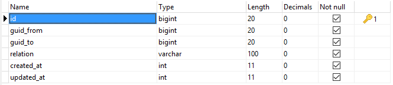

# Relations

* [What are relations?](#what-are-relations)
* [Creating Relations](#creating-relations)
* [Updating Relations](#updating-relations)
* [Deleting Relations](#deleting-relations)
* [Retrieving Relations](#retrieving-relations)
* [Counting Relations](#counting-relations)
* [IMPORTANT!](#important)

## What are relations?

Sometimes, we simply want to create applications on which things are related. For example:
* On a social network, users can follow each other or send friendship requests.
* On a CMS, posts belong to categories or pages can be hierarchical.
* On a forum, topics belong to a given thread.

Think of whatever you want :)



## Creating Relations
To create a new relation, you have two option:
```php
/*
 * Option #1:
 * Using the methid with an array as argument.
 * The array may contain all tables fields with
 * their respective values.
 */
$this->kbcore->relations->create($data);
// Example:
$this->kbcore->relations->create(array(
	'guid_from' => 1,
	'guid_to'   => 11,
	'relation'  => 'friend_request',
));

// Or you can use the helper:
add_relation($guid_from, $guid_to, $relation);
// Same example:
add_relation(1, 11, 'friend_request');
```

## Updating Relations
Here some example on how you can update existing relations:
```php
// Update a single relation by its known ID.
$this->kbcore->relations->update($id, $data);
// Example:
$this->kbcore->relations->update(25, array(
	'relation' => 'request_accepted',
));

/*
 * Update a single, all or multiple relations by
 * arbitrary WHERE clause.
 * In the example below, we are targetting all friend
 * requests and make sure to accept them all.
 */
$this->kbcore->relations->update_many(
	// 1st argument: WHERE clause.
	array('relation' => 'friend_request'),
	// 2nd argument: what to update.
	array('relation' => 'request_accepted')
);
// Or use helpers:
update_relation_by(...);	// Same arguments.
update_relations(...);		// Same arguments.
```

## Deleting Relations
Example of how to delete relations:
```php
// Delete a single relation by its ID.
$this->kbcore->relations->delete($id);
delete_relation($id); // The helper.

/*
 * To delete a single, all or multiple relations by
 * arbitrary WHERE clause, you can use the method below
 * or one of its alias (functions).
 */
$this->kbcore->relations->delete_by($field, $match);
// Its helpers:
delete_relation_by($field, $match);	// Same arguments.
delete_relations($field, $match);	// Same arguments.
```

## Retrieving Relations
Here are some example on how to retrieve relations:
```php
/*
 * To retrieve a single relation by its ID, you can use
 * the method below, or its helper.
 * They take the relation's ID as the first argument,
 * and a boolean as the second argument used to return
 * the relation's object OR the relation's type.
 */
// Retrieve a single relation by its ID.
$this->kbcore->relations->get($id); // Returns object.
$relation = get_relation($id); // The helper.

// To get the relation, we do:
echo $relation->relation;

// To retrieve it directly, use the second argument:
echo get_relation($id, TRUE);

/*
 * If you want to retrieve a single relation by
 * arbirary WHERE clause, you may want to use the
 * "get_by" method or its helper.
 * It accepts three arguments:
 * 1. The field used for comparison (may be an array).
 * 2. The comparison value (null if field is an array).
 * 3. A boolean to retrieve the relation type or the
 * retlation's object.
 */
$this->kbcore->relations->get_by($field, $match, $single);
// Or its helper:
get_relation_by($field, $match, $single);

/*
 * If $field is an array and you want to retrienve the
 * relation's type, make sure to use "NULL" as the
 * second argument, like so:
 */
get_relation_by(array('guid_to' => 1), NULL, TRUE);

/*
 * To retrieve multiple relations OR all relations,
 * you can use methods below:
 */
$this->kbcore->relations->get_many($field, $match, $limit, $offset);
$this->kbcore->relations->get_all($limit, $offset);

// Or their respective helpers:
get_relation($field, $match, $limit, $offset);
get_all_relations($limit, $offset);
```
## Counting Relations
Sometime you may want to count relations between entities. For instance:

* You want to know how many friends a user has;
* How many posts a category has;
* How many replies a thread has ... etc

You can use the provided method or its helper like so:
```php
$this->kbcore->relations->count($field, $match);
count_relations($filed, $match); // The helper.

/*
 * If no arguments are passed, all relations will be
 * counted. $field and $match are used to filter
 * relations and get the desired count.
 * In the examples below:
 * 1. How many blogs are under category id:12
 * 2. How many requests are waiting confirmation.
 */

// #1:
count_relations(array(
	'guid_from' => 12,			// The category's ID.
	'relation'  => 'post_cat',	// Example.
));

// #2:
count_relations(array(
	'guid_to'  => 7, // User's ID.
	'relation' => 'friend_request',
));
```

## IMPORTANT

All methods and functions are to be used in controllers. In case you want to use them in libraries, make sure to never use helpers because they will trigger an `undefined property: $kbcore` error.
