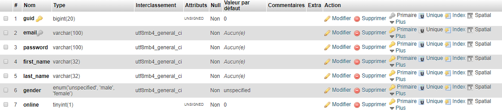

# Users

Users are one of the three available (*allowed*) entities types. Their data are stored in two (**2**) tables: **entities** and **users**.

* [Table Structure](#table-structure)
* [Creating Users](#creating-users)
* [Retrieving Users](#retrieving-users)
* [Searching Users](#searching-users)
* [Updating Users](#updating-users)
* [Deleting Users](#deleting-users)
* [Restoring Users](#restoring-users)
* [Counting Users](#counting-users)
* [IMPORTANT!](#important)

## Table Structure



All common data are stored in **entities** table (creation date, update date, status, privacy ...), the rest is stored inside **users** table: email, password, first name, last name, gender and online.

## Creating Users

In order to create a new user account, you can use the `create` method or its helper `add_user`. Example:

```php
$id = $this->kbcore->>users->create(array(
    'username'   => 'bkader',
    'email'      => 'bkader@mail.com',
    'password'   => 'this_is_MY_pa33w0rd',
    'first_name' => 'Kader',
    'last_name'  => 'Bouyakoub',
    'gender'     => 'male',
    'subtype'    => 'regular', // (*)
));
```

(\*) The subtype is important! If you don't set your own, the default one **regular** will be used. This is what divide your users into groups.
Here are some examples:

```php
'subtype' => 'administrator', // This is an admin.
'subtype' => 'premium', // Example for premium users ... etc
```

You can use the helper in your controllers as well:

```php
$id = add_user(array(
    'username'   => 'bkader',
    'email'      => 'bkader@mail.com',
    'password'   => 'this_is_MY_pa33w0rd',
    'first_name' => 'Kader',
    'last_name'  => 'Bouyakoub',
    'gender'     => 'male',
    'subtype'    => 'regular', // (*)
));
```

This function, and the method above it, will return the newly created user's **ID**, IF created! Otherwise they will return `FALSE`.

## Retrieving Users

In order to retrieve a single, multiple or all users, four (**4**) methods and their helpers and available to use.  
To retrieve a single user, you have two options:

```php
// Option 1
$user = $this->kbcore->>users->get($id);

// Or you can use the helper:
$user = get_user($id);
// $id here can be: INT, username or email address.


// Option 2: arbitrary WHERE clause.
$user = $this->kbcore->>users->get_by($field, $match);

// Or you can user the helper:
$user = get_user_by($field, $match);
```

To retrieve multiple users, you can user the **get_many** method like so:

```php
$users = $this->kbcore->>users->get_many($field, $match);

// Or you can use the helper:
$users = get_users($field, $match);
```

In the example above, **field** can be a string for a column name, or an associative array while **match** is the comparison value and can be anything even an *array* so that you can use the query builder's *where_in* method. Exampe:

```php
// To retrieve all users where ID is in the list.
$users = $this->kbcore->>users->get_many('id', [1, 7, 13]);

// Or the helper:
$users = get_users('id', [1, 7, 13]);
```

This method and its helper accept two more arguments (3rd and 4th) which are **limit** and **offset** that you can use for pagination purpose for instance. Example:

```php
$users = get_users('subtype', 'regular', 10, 1);
```

To retrieve all users from database, you can use the `get_all` method or its helper:

```php
$all_users = $this->kbcore->>users->get_all();

// Or the helper:
$all_users = get_all_users();
```

This method and its helper accept two arguments, **limit** and **offset** in case you want to use pagination. Example:

```php
$all_users = $this->kbcore->>user->get_all(10, 2);

// Or the helper:
$all_users = get_all_users(10, 2);
```

**Note**: the method `get_many` can retrieve all users as well, all you have to do is to pass `NULL` as the 1st and 2nd argument then pass you *limit* and *offset*. Example:

```php
$all_users = $this->kbcore->users->get_many(NULL, NULL, 10, 2);

// Or the helper:
$all_users = get_users(NULL, NULL, 10, 2);
```

As of version **1.3.x**, retrieves users are instances of **KB_User** object that you can interact with. Let's see some examples:

```php
// Retrieve the user.
$user = get_user(1);

// Access details:
echo $user->username;   // "entities" table.
echo $user->first_name; // "users" tabe.
echo $user->full_name;  // Generate when the user is found.
echo $user->company;    // Looks for a meta of name "company".

// To update a single data:
$user->update('username', 'new_username');  // Returns TRUE if updated, else false.

// To update multiple things, enqueue them then use the "save" method.
$user->username = 'new_username'; // OR $user->set('username', 'new_username');
$user->company = 'New Company';

// Save:
$user->save(); // Returns TRUE if updated, else false.
```

## Searching Users

As of version **1.3.x**, it is possible to search for users using the `find` method or its helper `find_users`. Let's see how you can use it and some examples:

```php
// How to use:
$users = $this->kbcore->users->find($field, $match, $limit, $offset);
$users = find_users($field, $match, $limit, $offset);

// Ordinary use:
$users = find_users('subtype', 'premium');  // Subype LIKE %premium%
$users = find_users('username', 'ian');     // Username LIKE %ian%

// Extended
$users = find_users(array(
    'subtype' => 'admin',   // Subtype LIKE %admin%
    'company' => 'ian',     // Have meta "company" and its LIKE %ian%
));
```

## Updating Users

To update a user, you can use the `update` method or the `update_user` helper. They both take the user ID as the first argument, and the array of data to set as the second (*array*). Example:

```php
$this->kbcore->>users->update(1, array(
    'first_name' => 'Ian',      // This is in "users" table.
    'language'   => 'english',  // This is in "entities" table.
    'privacy'    => 2,          // This one is in "entities" too.
));

// Or you can use the helper:
update_user(1, array(
    'first_name' => 'Ian',      // This is in "users" table.
    'language'   => 'english',  // This is in "entities" table.
    'privacy'    => 2,          // This one is in "entities" too.
));
```

These method and function will return `TRUE` if the account is updated. Otherwise they will return `FALSE`.

## Deleting Users

As explained on **entities** documentation, `delete` and `remove` are not alike. A deleted user still exists on the database but is flagged as **deleted**. Remove users are gone and all their data too. So be careful to what you want to use. Because delete and remove functions are almost alike in structure but different in function, we will only use `delete` as an example:

```php
// Delete a single user by ID or username.
$this->kbcore->>users->delete($id);

// Or you can use the helper:
delete_user($id);
```

If you want a little more freedom, you can use the following method:

```php
$this->kbcore->>users->delete_by($field, $match);
// Or you can user the helper:
delete_user_by($field, $match); // Alias: delete_users(...)

// Example #1:
delete_user_by('username', 'bkader'); // Only one target.

// Example #2:
delete_user_by('id', [1, 2, 3]); // Multiple targets.

// Example #3 (another version of Example #1):
delete_user_by(['username' => 'bkader']); // Single target.

// Example #4 (delete_users is an alias of delete_user_by).
delete_users([
    'subtype'      => 'regular',
    'enabled'      => 0,
    'created_at <' => time() - (DAY_IN_SECONDS * 2)
]);
```

In the example #4, we are deleting all accounts of type **regular**, that has not been activated yet AND were created two (**2**) days ago.

As I said earlier in this section, remove methods and functions are like those of delete. (BUT, don't forget that they completely erase data from database).

```php
// Single user by ID, username or email address.
$this->kbcore->>users->remove($id);
remove_user($id);

// Multiple users.
$this->kbcore->>users->remove_by($field, $match);
remove_user_by($field, $match);
remove_users($field, $match);
```

## Restoring Users

Only **soft-deleted** users can be restored! Not **removed** ones, these ones are completely erased. To restore users you do like the example below:

```php
// Restore a single user by ID.
$this->kbcore->>users->restore($id);
// Or you can use the helper:
restore_user($id);

// To restore multiple users.
$this->kbcore->>users->restore_by($field, $match);
// Or user can use helpers:
restore_user_by($field, $match);
restore_users($field, $match);
```

## Counting Users

You can count all existing users in your database like so:

```php
$count = $this->kbcore->>users->count($field, $match);

// Or you can user the helper:
count_users($field, $match);
```

Without arguments, these method and function will count all users.

---  

### IMPORTANT

All methods and functions are to be used inside controllers. In case you want to use them inside libraries, make sure to never use helpers because they may trigger an `undefined property: $kbcore` error.
