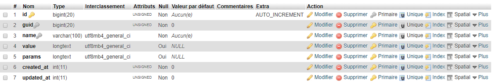

# Variables

* [What are variables?](#what-are-variables)
* [How to use?](#how-to-use)
* [Creating Variables](#creating-variables)
* [Updating Variables](#updating-variables)
* [Deleting Variables](#deleting-variables)
* [Retrieving Variables](#retrieving-variables)
* [What else?](#what-else)
* [IMPORTANT!](#important)

## What are variables?
Unlike **metadata**, variables are exactly
 what their name means! They varies often, they get created, updated and deleted all the time. Think of them as **temporary** metadata.
They can be used to store session-related data, temporary string used for accounts activation, password reset and more...
Even almost alike, **metadata** and **variables** tables are different. Variables table has three (**3**) additional columns:
* **params**: think of them as additional data you want to store.
* **created_at**: you guessed right? (*UNIX_TIMESTAMP*)
* **updated_at**: You guessed as well? No! Oh come on, the date in which the variable was updated! And the one above it holds the date in which it was created.



## Creating Variables
Just like metadata, the entity must exist! So after creating it and knowing its ID (**$guid**), you can do like the examples below.
```php
$this->kbcore->variables->create(array(
	'guid'   => $guid,
	'name'   => $name,
	'value'  => $value,
	'params' => $params,
));
// A similar one:
$this->kbcore->variables->add_var($guid, $name, $value, $params);
// Or you can use the helper:
add_var($guid, $name, $value, $params);
```
**NOTE**: These functions return `FALSE` if the variable exists already.

## Updating Variables
There are two methods to do this, both do the same thing by have different targets. Let me explain in an example:
```php
$this->kbcore->variables->update($id, array(
	// Here goes what to upload. i.e:
	'value'  => $new_value,
	'params' => $new_params,
));
// Or use the helper:
update_var($id, array(...));
```
This method targets a single variable and it uses its **ID** as the first argument.

If you want to update multiple variables (or a single one) using arbitrary *WHERE* clause, you can do like the following:
```php
$this->kbcore->variables->update_by($where, $data);
// $where and $data must be arrays.
// Or use helpers:
update_var_by(...); // OR: update_vars(...);
```
**NOTE**: As you can see, the data to update is always considered to be last argument. Anything else before it will be used as _WHERE_ clause. So in case you pass on the **$where** that's in the example above, it will be treated as the data to update and **ALL** will variables will be updated. So be careful when using this method.
```php
// All vars will be updated.
$this->kbcore->variables->update($data);
// Or use helpers:
update_var_by($data); // Or: update_vars($data);
```
**NOTE**: There is an additional method and its helper that allows you to update a variable if it exists OR create it if it does not.
```php
$this->kbcore->variables->set_var($guid, $name, $value, $params);
// Or its helper:
set_var($guid, $name, $value, $params);
```

## Deleting Variables
In order to delete variables, there are two method and their two helpers.
The example below targets a single variable and it uses its ID:
```php
$this->kbcore->variables->delete($id); // A single variable by ID.
// Or its helper:
delete_var($id);
```
If you want to target multiple variables, you can use the following:
```php
$this->kbcore->variables->delete_by($field, $match);
// Or the helper:
delete_var_by(...) // Or alias: delete_vars(...);
```
In the example below, **field** can be an associative array that will be used as the _WHERE_ clause, or a simple string to choose the column to use for comparison.
In the other hand, **match** can be the comparison value use to target variables, or an array if values in order to delete multiple variables where **field** is IN **match**.
```php
$this->kbcore->variables->delete_by('guid', array(1, 3, 7));
// To target all variables where 'guid' is in the list.
```
**NOTE**: This method in kind of limited, especially if you have stored an array in the column (value or params). So in order to use arrays, make sure to use the provided function **to_bool_or_serialize** function on your arrays so they will be converted to strings before comparison.

## Retrieving Variables
The example below retrieves a single variable by its ID.
```php
$this->kbcore->variables->get($id); // $id of the variable.
// Or the helper:
get_var($id);
```
This accepts a second arguments (**single**) that you can use to retrieve the value only instead of the object:
```php
$this->kbcore->variables->get($id, TRUE);
// Or the helper:
get_var($id, TRUE);
```
The example below, retrieve a SINGLE variable by arbitrary _WHERE_ clause.
```php
$this->kbcore->variables->get_by($field, $match);
// Or the helper:
get_var_by($field, $match);
```
And to retrieve multiple variables, you can do like the following:
```php
$this->kbcore->variables->get_many($field, $match);
// Or the helper:
get_vars($field, $match);
```
Without any arguments, this method retrieves all variables.
* __field__: can be a string or an associative array.
* __match__:  can be anything even an array.

## What else?
There is an additional method and its helper that do nothing but deleting variables of which entities no longer exist (no owner). Because I think it is useless to keep them, I added these functions.
```php
$this->kbcore->varialbes->purge();
// Or the helper:
purge_vars();
```

## IMPORTANT
All methods and functions are to be used in controllers. In case you want to use them in libraries, make sure to never use helpers because they may trigger an `undefined property: $kbcore` error.
